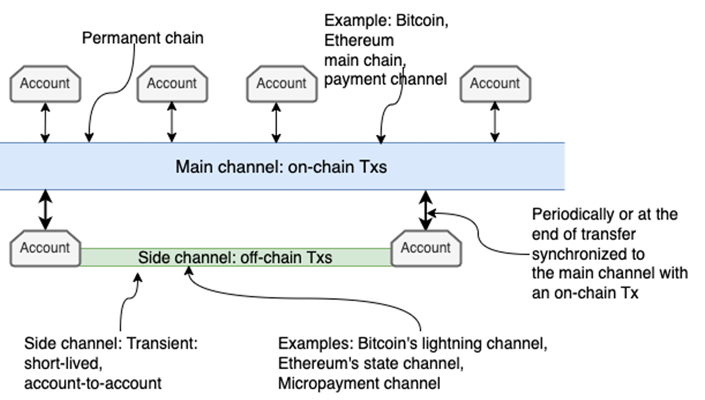
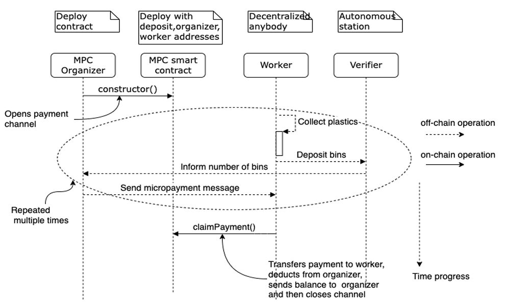

# Blockchain-based Planetary Level Autonomous Systems

> **Table of Contents**
> 

## **Source**

Blockchain-based Planetary Level Autonomous Systems

Bina Ramamurthy, CSE Department, University at Buffalo 
& Kumar Madurai, ISE Department, University at Buffalo

## Introduction

- What is a planetary level problem?
    - A problem on a “planetary” scale… global problem faced by communities all around the world
    - These problems are almost, if not impossible to solve using a centralized system
- What is the solution to planetary level problems?
    - It requires a grass-root movement - collective action from people in communities to drive change from a local, to regional, to national, to global scale
- In order for a solution to **scale & sustain**, it must be:
    - Self-organized: grassroots, collective
    - Self-sustained: incentives, reward-system
- Example - Recyclable Plastic Garbage
    - My Solution & Actions
        - Solution: World cleanup - everyone locally needs to do their part
        - Actions: Local level, pick up trash, recycle, don’t litter. Need some sort of reward system such as bottle deposit - get paid to recycle.
    - Their solution
        
        Local club is organizing a volunteer-based cleaning day. For such systems to **scale and sustain**, a trusted platform for participant engagement is needed.
        

<aside>
💡  A public blockchain infrastructure such as Ethereum can provide a **trusted platform**

</aside>

## **Feature 1: Trust Platform**

- A common platform where any capable person or machine can join
- Public blockchain can be this public platform for
    1. [Peer to peer](https://www.notion.so/Vocabulary-5b7672b421554ae1a183b76a73eb3da8) transactions - two individuals interact directly with each other… without any intermediaries
    2. [Immutable transactions](https://www.notion.so/Vocabulary-5b7672b421554ae1a183b76a73eb3da8) on a [distributed ledger](https://www.notion.so/Vocabulary-5b7672b421554ae1a183b76a73eb3da8) - allows for anyone to have a copy of that **cannot be changed**

## **Feature 2: Participant Identity**

- Every person needs a unique ID… but there’s no central authority to assign IDs
- The solution:
    - **Self-generated** participant ID based off a (256-bit) private-public key pair, [SHA hashing](https://www.notion.so/Vocabulary-5b7672b421554ae1a183b76a73eb3da8), and Elliptic Curve Cryptography
    - Participants are open to join and leave whenever wanted
    - Participants must generate their ID, secure their private-key, and keep track of their accounts, balances, keys, etc.
        - A **wallet** helps users do this

## **Feature 3: Wallet**

- Manages the accounts, balances, and private keys
- Also able to confirm & sign transactions, choose a blockchain network, lock, unlock, recover the wallet
    - Recovers the wallet with a **recovery phrase of keywords** & deterministic wallet generation algorithm
        - Enables portability to other devices - flexibility of using it **anywhere**.
- Can be software (plugin or mobile app) or hardware wallet (cold storage)
    - The ability to use it via mobile **significantly improves accessibility**;
        - Remember, **broader** **participation** is essential for a successful solution to a planetary-level problem.

## **Feature 4: Smart Contract**

- The [DAO](https://www.notion.so/Vocabulary-5b7672b421554ae1a183b76a73eb3da8) (in this case: the planetary system) is realized using [smart contracts](https://www.notion.so/Vocabulary-5b7672b421554ae1a183b76a73eb3da8)
- **Differs** from other traditional code because it has a [smart contract address](https://www.notion.so/Vocabulary-5b7672b421554ae1a183b76a73eb3da8)
- Can define data, functions, and rules to access the data and functions
    - Data represents the **state of the DAO**
    - Functions represent the **operations of the DAO**
    - Ability do **declare rules** to change the state & execution of operations
        - These changes are autonomously added to the blockchain’s immutable ledger
            - Demonstrates trust & integrity

<aside>
💡 A smart contract is the **decentralized digital equivalent** of a traditional centralized organization but operates **autonomously** once deployed

</aside>

- ***The DAO is a long-running, and self-governing entity allowing diverse participation to perform a large-scale collective operation.***

## **Feature 5: Governance**

- Funds are added & locked into the smart contract, then when deployed, it runs autonomously
- The DAO’s governance is **democratized** by involving the participants
    - Governance is implemented with **other smart contracts** that embodies:
        - Rules & procedures
        - Voting by stakeholders to pass or reject proposals
        - Incentives for participation in governance
    - In essence, governance allows for participants to **self-govern**, **incentivize** contributions to the DAO, **reward** good behavior, and **manage** exceptions & bad behavior

## **Feature 6: Micropayments**

<aside>
💡 **Participant engagement** is critical for the success of planetary-level systems

</aside>

- [Micropayments](https://www.notion.so/Vocabulary-5b7672b421554ae1a183b76a73eb3da8) have been around before, many unsuccessful systems in the past
    - Micropayments normally **do not** involve banks, etc.
    - Bitcoin blockchain makes it **reasonable** to make online payments to unknown peers - essentially reviving the micropayments concept
    - Micropayment Channel Concepts:
        - Defined by endpoints, the addresses of sender & receiver
        - Facilitates **micro** & **frequent** payments between them
        - Transaction fees charged are minimal, **less than** payment amount being transferred
        - Sender & Receiver relationship is **terminated** after transaction is complete
    - Diagram of channels
        - **The micropayment channel is the side channel**
        - Gets info gets updated to the payment channel once transaction is complete
        
        
        
        Relationship between Micropayment Side Channel & Main Channel / Chain
        

## A Planetary-Level Use Case

### The problem: Massive Plastics Cleanup (MPC) on Earth

- Why is the MPC problem a perfect decentralized problem?
    - Because not one organization (ex. United Nations) can send people to clean up in every country in the world

<aside>
💡 The MPC problem has a global scope where participants are decentralized & not necessarily known to each other.

</aside>

### The Solution:
- Verification mechanism
    - Used to **verify plastics** in the bins have right **amount & type** of plastics
    - If not, bin of plastics will get **rejected**
    - Every time bin gets verified, message is sent to the patron organization; user gets rewarded with a [micropayment](https://www.notion.so/Vocabulary-5b7672b421554ae1a183b76a73eb3da8) through a [channel](https://www.notion.so/Blockchain-based-Planetary-Level-Autonomous-Systems-d1296cfceed9413c97e1ab8103fad3f8) from the patron to the worker
- Payment mechanism
    - Could be many micropayments to a worker in a single collection session
    - Micropayment = sum of all previous micropayments added to the current one, thus:
        - Continually **increasing**
        - Accounting for work completed
        - Prevents double-spending / cashing the same payment more than once
    - Cash-out at the last bin of the day through **one on-chain** **transaction** **(Tx)**, instead of each bin collection
        - This way, the single Tx request is for value of final micropayment
            - Remember, Tx holds the accumulated value of micropayments of the day
- Channel mechanism
    - Channel is closed after payment is made
        - Could also be open in an alternative design, but this way **helps prevent double-spending**
    - New channel gets created
    - Process repeated for each worker
### The Diagram
- Notes:
    - Smart contract is deployed with `constructor()` (on-chain)
    - `claimPayment()` notes end of session (on-chain)
    - Everything else in between is off-chain and repeats until session ends
    - Read from top to bottom

    

    Sequence Diagram – Planetary Level Autonomous System MPC
        

## Summary

- Here’s what I’ve learned:
    - Blockchain can be used to solve planetary problems, those that need to be solved at a grass-roots approach
    - After learning about a potential real-life use case, I’ve formulated a similar one that could be used to do so
        - This could probably be a great way to solve the pollution - carbon-levels around the world
            - If people are incentivized to not do certain things, such as drive their gas-powered car, waste electricity, eat beef, etc., then it would be much more convincing for people to actually take a part in saving the environment, essentially at a grass-roots level
    - Blockchain features are unique and open doors to approaching problems from a whole different angle… such features include: Trust platforms, identity verification, smart-contracts, wallets, governance, micropayments
    - Blockchain technology can be adopted into every-day systems and infrastructure, with the potential to solve problems that could never be solved before
