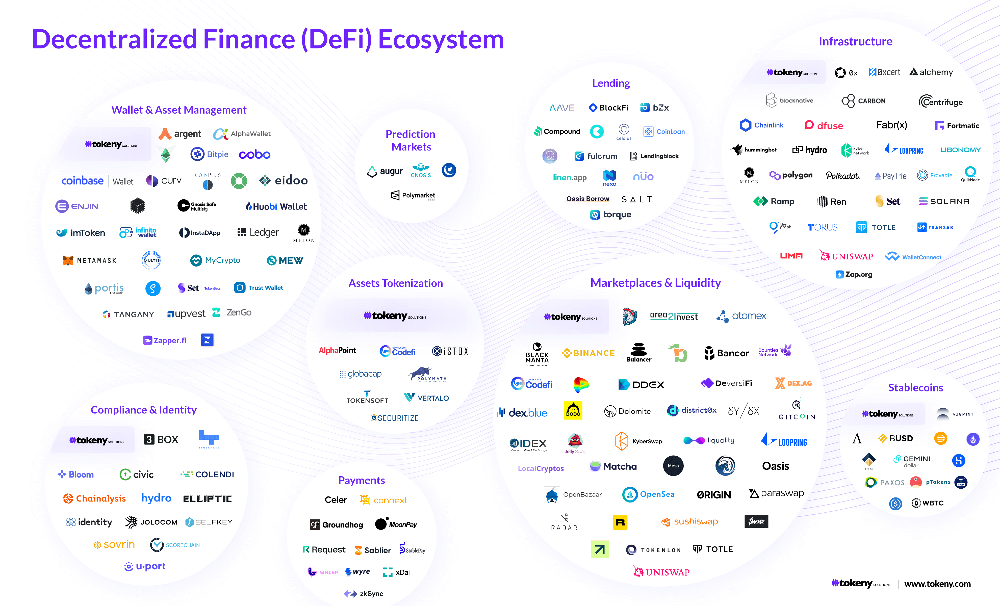

# Oral Presentation

This is my planner for my oral presentation. 

The large headings indicate the components / sections of an oral presentation (Hypothesis, Define Terms / Concepts, Materials & Methods, Results, Analysis & Conclusions, Further Research, Closure). 

The toggle lists reveal details on what the section should include. 

The smaller / sub-headings represent each slide title, and the body is the content included in the slide.

> Table of Contents
> 

# Hypothesis

- Hypothesis
    - don’t include independent variable
    - can title it “Goal”
    - example:
        - “Hope to determine if possible to reduce what…”

### Goal

Reduce entry-level barrier for participating in DeFi by providing users with transparent information on the amount of centralization that exists within liquidity-pool-based Decentralized Exchange protocols.

# Define Terms / Concepts

- Define Terms / Concepts ()
    - Pics and vids, and bullets!
    - example:
        - “Why are fractals important?”
        - “How are fractals made?”
        - Mention Turtle, how it works with Python, and include video on next slide on it

### What is Blockchain?

(Mention multiple types of blockchains)

### What is DeFi?

- Short for Decentralized Finance, DeFi is an umbrella term for peer-to-peer financial services on public blockchains, primarily Ethereum

### Liquidity Pools & AMM

### Decentralized Exchanges

(Include logos of uniswap, bancor, all dexes I will be analyzing (maybe highlight))

### What Components can make Decentralized Exchanges Centralized?

- Development (last)

# Materials & Methods

- Materials and methods
    - provide just enough detail for the audience to understand **how** data was collected, what was kept constant and length of the experiment
    - can use photographs and vids taken during the experiment
    - pics of experimental design and data collection or simple table that describes experiment
    - example:
        - “learn python and how to use turtle”
        - “practice producing fractal images using turtle and …”
        - “affine transformations used to make fractal tree”
        - “code that created the fractal tree”
        - “some math equations and graphs with matrices”

# Results

(go one by one on protocols)

- Results
    - display and explain results clearly and succinctly
    - choose figures and table that best highlight the results
    - when using graphical data, take time to explain what the graphic shows overall before talking about specific results
        - takes time for audience to understand they are looking at
        - add photos and videos from control and experimental group it can help audience understand research study even more

# Analysis and Conclusions

- Analysis and Conclusions
    - remind audience of connection to make
    - describe how confidence I am that the research design produced reliable data that either supported, or did not support relationship between independent and dependent variable or a comparison between two groups
    - explain how I got to this conclusion
    - example:
        - these matrices represent the affine transformations used to create fractal tree

# Further Research

- Further Research / Future Work ()
    - “A more in depth study of the inverse affine transformations used to create these ferns could reveal a hidden transform process that can be used to create a method to observe a fractal and deduce which …”

# Closure

- Closure
    - make a statement regarding relationship between independent and dependent variable
    - say how your research specifically makes an impact on the global-scale problem
    - “Thanks to mentor LSAMP, NSF, Department of CSE at UB”
        - Can do pics of all logos!
    - “thank you for listening! Does anyone have any questions?”