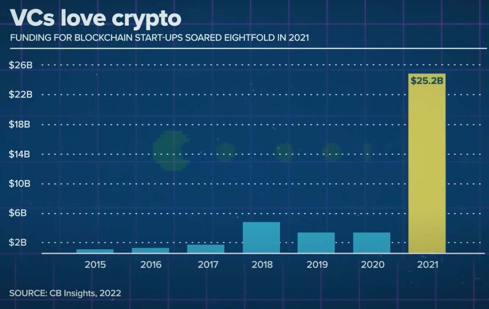
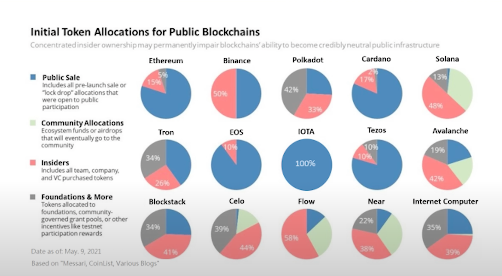

# References

> **Table of Contents**
> 

### LSAMP Library Resource

[Research Guides: LSAMP Summer Research Program Library Resources Guide: Home](https://research.lib.buffalo.edu/lsamp-research-guide/home)

### Blockchain-based Planetary Level Autonomous Systems

Bina Ramamurthy, CSE Department, University at Buffalo 
& Kumar Madurai, ISE Department, University at Buffalo

- Inspired by the format, especially the listing of the features
- Could use info on wallets, smart contracts, other features that make DeFi… DeFi
- Blockchain solves planetary level problems in this case
    - What major problems do DeFi solve?
        - Maybe it doesn’t solve major problems, but rather… changes the way we look at finance - essentially having a new perspective, which can now allow us to open new doors in the future. **Olaf Carlson-Wee** discusses this.

### **Olaf Carlson-Wee**

[Meet The Crypto Pioneer Leading The DeFi Movement | Forbes](https://youtu.be/MfY45cJptao)

- one of crypto’s top venture investors, founder of Polychain Capital
- “If this whole thing works, I think it's the largest **wealth transfer** in kind of the shortest period of time in human history. It doesn't fix problems like wealth inequality but it does in a sense sort of **shake the snow globe** so it **radically alters the logic** of property ownership and who owns what and how global monetary systems work. So I think the opportunity is absolutely massive.”
- “One thing that's very cool about it is people like me can participate in that it's not limited to the old guard, legacy financial elites.” **12:05 - 12:50**

### **MIT Technology Review**

bimonthly magazine wholly owned by MIT & editorially independent of the university

[The Money issue](https://www.technologyreview.com/magazines/the-money-issue/)

### **Web5**

a new decentralized web framework based on the Bitcoin Lightning Network designed to replace Web3. Created by Jack Dorsey

[Copy of Decentralized Web Platform - Public](https://docs.google.com/presentation/d/1mNekQidtXJib4VMTAm2UAJuKPn5w2uMSjdT8rFDAwAE/edit?usp=sharing)

[Elon Musk and Jack Dorsey are skeptical of 'Web3.' Here's why](https://youtu.be/eAMCcnxXLhM)

- **Web3 is centralized.**
    - Venture Capitalists (VCs) have flooded the Web3 space in 2021 more than ever.
    
    
    
    - There’s concern that VCs (essentially a small group of wealthy investors) hold too much control, more than the public community, which creates centralization. This depends on token allocations for each project
    - Instead of VCs getting shares of a company / equity, for web3 they get crypto tokens during early stages, when they aren’t even dispersed to the general public yet
    - Some of these projects are “pump and dump”
        - Need to really do research and find which ones are legitimate
        - How much governance are VCs taking in the project???
            - “If they are smart enough to say ‘we are here to invest , and we want the project to grow, and we want to participate in the governance, but there’s room for others to also participate in it’, I would say that’s the good way to se VC investments in the web3 world.” **6:20 - 6:45**
    
    
    

### **Lex Fridman**

AI researcher working on autonomous vehicles, human-robot interaction, and machine learning at MIT and beyond - hosts podcasts with numerous icons in the tech space

### Random articles I have found

[Decentralized Finance: On Blockchain- and Smart Contract-Based Financial Markets](https://research.stlouisfed.org/publications/review/2021/02/05/decentralized-finance-on-blockchain-and-smart-contract-based-financial-markets)

[web3 is Centralized](https://blog.wesleyac.com/posts/web3-centralized)